climateNiche: R package for analysing the climatic niche of a species
================

## R-Setup

### Load required packages

Load required packages from CRAN

``` r
#Automatically install required packages, which are not yet installed
packages <- c("rgbif", "sp", "raster", "dplyr", "sf", "ggplot2", "rebird", "remotes", "outliers")
new.packages <- packages[!(packages %in% installed.packages()[,"Package"])]
if(length(new.packages)) install.packages(new.packages); rm(new.packages)

# Load packages
l <- sapply(packages, require, character.only = TRUE, quietly=TRUE); rm(packages, l)
```

Load additional packages from GitHub

``` r
# Instal missing packages from GitHub
packages_github <- c("rasterSp", "climateNiche", "ggmap2", "rISIMIP")
new.packages <- packages_github[!(packages_github %in% installed.packages()[,"Package"])]
if(length(new.packages)) remotes::install_github(paste0("RS-eco/", new.packages), build_vignettes=T)
rm(new.packages)

# Load additional packages
l <- sapply(packages_github, require, character.only = TRUE, quietly=TRUE); rm(packages_github, l)
```

### Specify file path

**Note:** You need to change this to a location, where you have the
required input data stored and/or where you want to have all the output
data stored.

``` r
#Set file directory
filedir <- "/home/matt/Documents/"
```

## Get species data

### IUCN/BirdLife Data

We have rasterized IUCN and BirdLife range maps of amphibians,
terrestrial mammals, birds and reptiles to a resolution of 0.5°. Details
of how this was done, can be found in the
[`rasterSp`](https://github.com/RS-eco/rasterSp) package.

We can directly read the distribution data for all species of these taxa

``` r
data(amphibians_dist, package="rasterSp")
data(ter_birds_dist, package="rasterSp")
data(ter_mammals_dist, package="rasterSp")
data(reptiles_dist, package="rasterSp")
```

Rasterized species range data for the house sparrow *Passer domesticus*
and the great sparrow *Passer motitensis* is also included in this
package and can be accessed by:

``` r
# Load data of the house sparrow
data(Passer_domesticus)

# Load data of the great sparrow
data(Passer_motitensis)
```

#### Plot species range

``` r
# Display the range map of one species
plotSp(data=Passer_domesticus, extent=c(-180, 180, -65, 90))
```

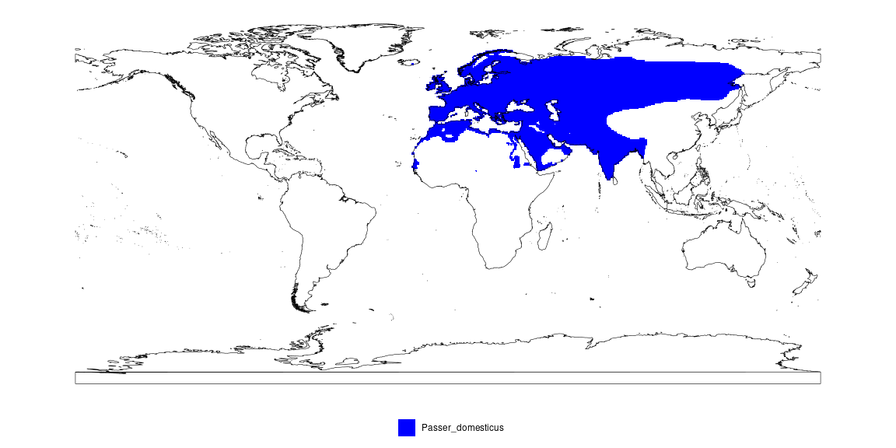<!-- -->

### eBird Data

eBird data can be accessed through the `rebird` package available on
CRAN. However, this only gives access to the records of the last 14 days
and requires Internet access.

``` r
## Search for bird occurrences by latitude and longitude point
data <- ebirdgeo(species_code('Passer domesticus'), 42, -76)

## Same, but with additional parameter settings, including provisional records, and hotspot records
data <- ebirdgeo(species_code("Passer domesticus"), lat = 42, lng = -76, includeProvisional = TRUE, hotspot = TRUE)

## Search for bird occurrences by region and species name
data <- ebirdregion(loc = 'US', species = species_code('Passer domesticus'))

## Search for bird occurrences by their location IDs
data <- ebirdregion(loc = c('L99381','L99382'))

## Search by location ID and species name, as well as some additional parameter settings
data <- ebirdregion(loc = 'L99381', species = species_code('Passer domesticus'), max = 10, provisional = TRUE, hotspot=TRUE)

## Obtain frequency data for a given state or county
data_freq <- ebirdfreq(loctype = 'states', loc = 'CA-BC')
# loctype= states, counties, hotspots, startyear, endyear, startmonth, endmonth, long=TRUE or FALSE

## Search for notable sightings at a given latitude and longitude
data_notable <- ebirdnotable(lat = 42, lng = -70)

## Return eBird taxonomy
#ebirdtaxonomy()
```

The `rebird` package, only gives you data from the last 14 days, when
analysing species distributions it is best to download the whole ebird
Database from their website. The original eBird Datafile is around 150
GB in size, we converted the file to a sqlite database, which can be
read using R on any computer, without running into memory limitations.
To obtain a copy of the ebird database just get in touch with me or
check out the `vignette("create-ebird-db")` vignette in order to know
how to create the database yourself.

``` r
# Connect to ebird database
con <- DBI::dbConnect(RSQLite::SQLite(), dbname = paste0(filedir, "/ebird_database.sqlite"))

# Get eBird data of Passer_domesticus
ebird <- tbl(con, "ebird")
Pass_dom <- ebird %>% dplyr::filter(`SCIENTIFIC NAME` == "Passer domesticus") %>% 
  data.frame()

# Disconnect from database
DBI::dbDisconnect(con); rm(ebird, con)
```

**Note:** The database contains a considerable smaller number of records
for each species compared to the eBird Website (<http://ebird.org>), as
this database contains only verified records.

Create plot of eBird data

``` r
# Load outline data
data(outline, package="ggmap2")

# Plot locations and size of points according to Observation count
ggplot(data=Pass_dom, aes(x=LONGITUDE, y=LATITUDE)) + 
  geom_point(aes(size=OBSERVATION.COUNT, col=month)) + 
  geom_polygon(data=outline, aes(x=long, y=lat, group=group), 
                 fill="transparent", color="black") + 
  coord_quickmap(xlim=c(-130,-45), ylim=c(-35,65)) + 
  theme_bw()
```

### GBIF Data

Download occurrence data from GBIF using the rgbif package. This
approach is limited to 200000 data entries, but here we limit it to
20000 entries, as data takes a long time to download.

``` r
sp_data <- rgbif::occ_data(scientificName="Passer domesticus", limit=20000, 
                           year=1970, month='1,12', hasCoordinate=TRUE)
sp_data <- sp_data$data[,c("name", "decimalLatitude", "decimalLongitude", 
                           "year", "month", "day")]
#unique(sp_data$month)
```

Turn sp_data into a SpatialPointsDataFrame

``` r
coordinates(sp_data) <- ~decimalLongitude+decimalLatitude
crs(sp_data) <- sp::CRS("+proj=longlat +datum=WGS84 +no_defs +ellps=WGS84 +towgs84=0,0,0")
```

Alternatively, we can use the `terrestrialGBIF` function from the
`climateNiche` package, which automatically downloads the data, removes
outliers and points which are not on land. In addition, the file is
saved to a specified path so that the data does not have to be
downloaded over and over again.

``` r
sp_data <- terrestrialGBIF("Passer domesticus", limit=20000, hasCoordinate=TRUE, 
                           path=paste0(filedir, "/GBIF/"))
```

For analysing GBIF data of multiple species, it is easier to download
all the data from the GBIF Website (ca. 350 GB) and create a sqlite
database from it. In order to obtain a copy of the database, just ask me
or have a look at the `vignette("create-gbif-db")` vignette in order to
create the database yourself.

``` r
# Connect to GBIF database
con <- DBI::dbConnect(RSQLite::SQLite(), dbname=paste0(filedir, "gbif_database.sqlite"))

# Get gbif data of Passer_domesticus
gbif <- tbl(con, "gbif")
sp_data <- gbif %>% filter(species == "Passer domesticus") %>% collect() %>%
  data.frame()

# Disconnect from database
DBI::dbDisconnect(con); rm(gbif,con)
```

Create plot of gbif data

``` r
# Load outline data
data(outline, package="ggmap2")

# Plot locations
sp_data <- as.data.frame(sp_data)
ggplot() + geom_point(data=sp_data, aes(x=decimalLongitude, y=decimalLatitude), col="red") + 
  geom_sf(data=outline, fill="transparent", color="black") + 
  coord_sf(xlim=c(-160,180), ylim=c(-55,75), expand=F) + theme_bw()
```

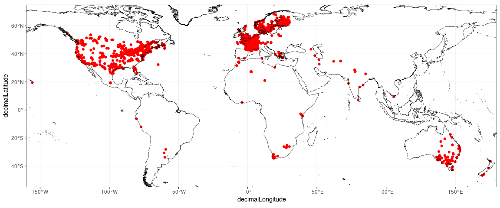<!-- -->

## Read environmental data

### WorldClim Data

Using the `getData` function from the raster package, we can extract
altitude, tmin, tmax and prec as well as 19 bioclimatic variables. The
function downloads global bioclim data with a resolution of 10 Arc min
and save the file to a subfolder called wc10 located at the path
previously specified as filedir.

**Note:** If the data has been downloaded once to the specified path, it
automatically loads these data instead of downloading them again.

Here, the resolution is 10, but worldclim also provides 0.5, 2.5 and 5
ArcMin grid sizes. Note that for the 0.5 resolution, we would need to
specify a latitude and longitude value, as in this case getData only
downloads and reads one tile and not the entire earth.

``` r
bioclim <- getData(name="worldclim", download=TRUE, path=filedir, res=10, var="bio")
```

#### Here is a description of the 19 bioclimatic variables:

- bio1 = Mean annual temperature
- bio2 = Mean diurnal range (mean of max temp - min temp)
- bio3 = Isothermality (bio2/bio7) (\* 100)
- bio4 = Temperature seasonality (standard deviation \*100)
- bio5 = Max temperature of warmest month
- bio6 = Min temperature of coldest month
- bio7 = Temperature annual range (bio5-bio6)
- bio8 = Mean temperature of the wettest quarter
- bio9 = Mean temperature of driest quarter
- bio10 = Mean temperature of warmest quarter
- bio11 = Mean temperature of coldest quarter
- bio12 = Total (annual) precipitation
- bio13 = Precipitation of wettest month
- bio14 = Precipitation of driest month
- bio15 = Precipitation seasonality (coefficient of variation)
- bio16 = Precipitation of wettest quarter
- bio17 = Precipitation of driest quarter
- bio18 = Precipitation of warmest quarter
- bio19 = Precipitation of coldest quarter

### Transform data

**Note:** The temperature variables have to be divided by 10 to get
actual °C.

``` r
bioclim_temp <- calc(bioclim[[c(1,2,5,6,7,8,9,10,11)]], fun=function(x){x/10})
bioclim <- stack(bioclim_temp[[c(1:2)]], bioclim[[c(3:4)]], bioclim_temp[[c(3:9)]], bioclim[[c(12:19)]]); rm(bioclim_temp)
names(bioclim) <- paste0("bio", 1:19)
```

### ISIMIP2b Climate data

Alternatively, we can also load the landonly processed ISIMIP2b data at
a resolution of 0.5°. Load present Bioclim ISIMIP2b files

``` r
data(bioclim_ewembi_1995_landonly, package="rISIMIP")
```

## Extract environmental data

Now, we want to extract the environmental data for each presence point
of our bird species.

``` r
sp_data <- sp_data[complete.cases(sp_data$decimalLatitude, sp_data$decimalLongitude),]
coordinates(sp_data) <- ~decimalLongitude+decimalLatitude
crs(sp_data) <- sp::CRS("+proj=longlat +datum=WGS84 +no_defs +ellps=WGS84 +towgs84=0,0,0")
sp_bio <- raster::extract(bioclim, sp_data, df=TRUE); rm(bioclim)
sp_data@data <- cbind(sp_data@data, sp_bio); rm(sp_bio)
```

Our bird species might have different ranges throughout the season.
Therefore, we use `sptExtract()` to extract monthly temperature values
for our species.

``` r
# Get temperature data
tmean <- raster::getData(name="worldclim", path=filedir, res=10, var="tmean")

# Transform into degrees
tmean <- raster::calc(tmean, fun=function(x){x/10})
names(tmean) <- paste0("tmean", 1:12)

# Remove data where no month is provided
sp_month <- sp_data[which(!is.na(sp_data$month)),]

# Extract monthly temperature
sp_month <- sptExtract(sp_month, tmean, tres="month"); rm(tmean)

# Plot monthly mean temperature niche of Passer domesticus
ggplot(data=sp_month@data) + geom_boxplot(aes(x=factor(month), y=env_locs)) + 
  labs(x="Month", y="Monthly mean temperature (°C)") + theme_bw()
```

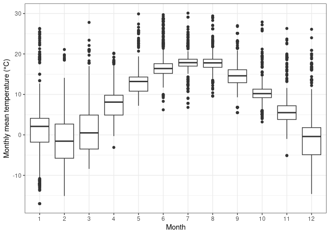<!-- -->

## Environmental niche summary

``` r
# Summarise the climatic niche of our species
sp_month@data %>% group_by(month) %>% summarise(tmean=mean(env_locs, na.rm=T)) %>% 
  rename(Month = month) %>% mutate(Month = factor(Month, labels=month.abb)) %>% t() %>%
  knitr::kable()
```

|       |           |            |           |           |            |            |            |            |            |            |           |            |
|:------|:----------|:-----------|:----------|:----------|:-----------|:-----------|:-----------|:-----------|:-----------|:-----------|:----------|:-----------|
| Month | Jan       | Feb        | Mar       | Apr       | May        | Jun        | Jul        | Aug        | Sep        | Oct        | Nov       | Dec        |
| tmean | 1.0690476 | -1.2251497 | 1.3756536 | 7.9549533 | 13.2430175 | 17.1804675 | 17.9438335 | 17.8309858 | 14.7379603 | 10.5456710 | 6.8436364 | -0.7633238 |

## Visualise climatic niche

### displayNiche

`displayNiche` is a function that plots the climatic/environmental niche
of a given species. The function is included in the `climateNiche`
package.

Annual temperature (min/max) & precipitation niche of GBIF data

``` r
# Display temperature and precipitation niche using Worldclim data
displayNiche(data=data.frame(sp_data), res=10, variables=c("tmin", "tmax", "prec"), path=filedir)
```

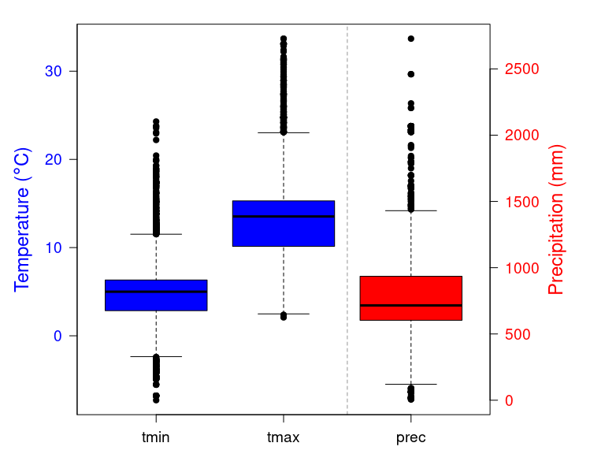

Bioclim niche from IUCN range Map

``` r
# Display bioclimatic niche using Worldclim data
displayNiche(data=Passer_domesticus, res=10, variables=c("tmax", "prec"), path=filedir)
```

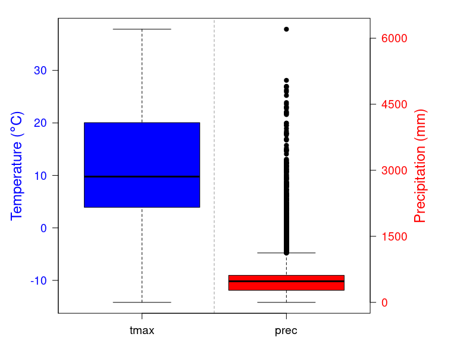

Compare the climatic niche of one species using monthly and quarterly
maximum temperature and precipitation data and qua

``` r
# Plot the monthly climatic niche of a species
displayNiche(data=Passer_domesticus, path=filedir, variables=c("tmax"), tres="month", res=10)

# Plot the monthly climatic niche of a species
displayNiche(data=Passer_domesticus, path=filedir, variables=c("tmax", "prec"), 
             tres="month", res=10)

# Plot the quarterly climatic niche of a species
displayNiche(data=Passer_domesticus, path=filedir, variables=c("tmin", "tmax", "prec"), 
             tres="quarter", res=10)
```

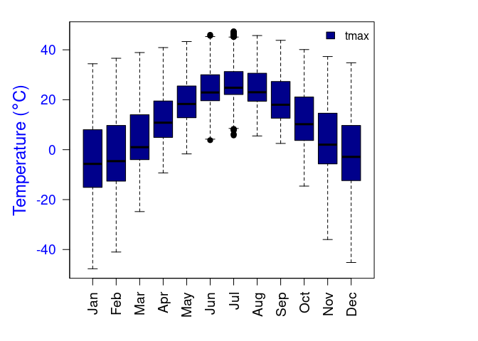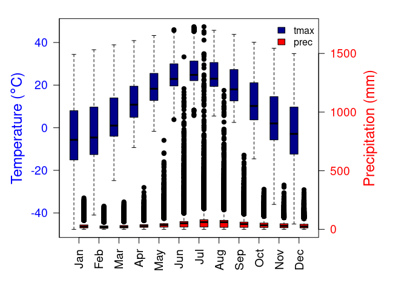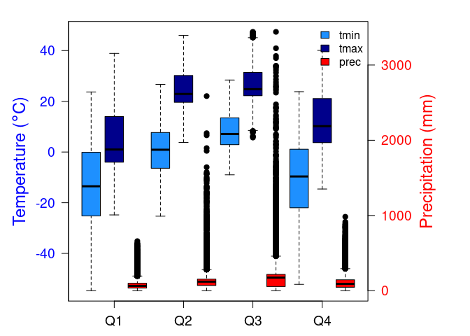

### Compare the niche of two species

``` r
# Load raster file of IUCN species range map of the Great sparrow
data(Passer_motitensis)

# Create list of 2 species
Passer_spp <- list(Passer_domesticus, Passer_motitensis)

# Display the range map of both species
plotSp(data=Passer_spp, extent=c(-180, 180, -65, 90))
```

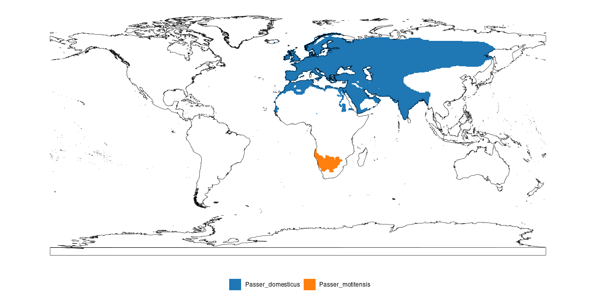

``` r
# Load data of the Somali sparrow & the Asian desert sparrow
data(Passer_castanopterus)
data(Passer_zarudnyi)

# Create list of 4 species
Passer_spp4 <- list(Passer_castanopterus, Passer_domesticus, 
                    Passer_motitensis, Passer_zarudnyi)

# Display the range map of four species
plotSp(data=Passer_spp4, extent=c(-180, 180, -65, 90))
```

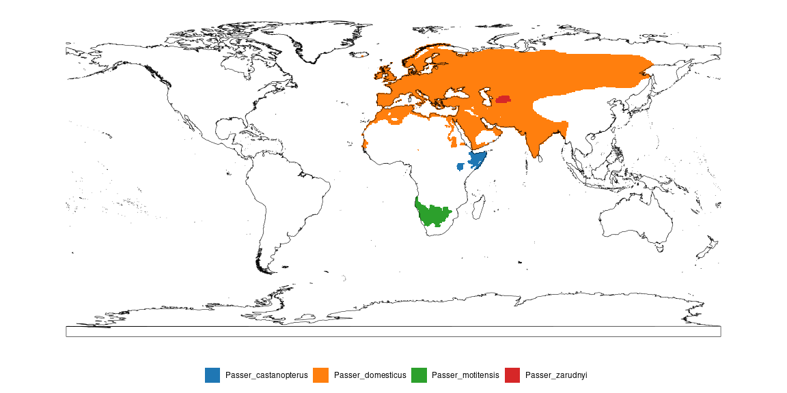

Compare the climatic niche of four species using the most important
bioclimatic variables (bio5, bio12, bio15)

``` r
# Compare the climatic niche of four species
displayNiche(data=Passer_spp4, path=filedir, variables=c("bio5", "bio12", "bio15"), res=10)
```

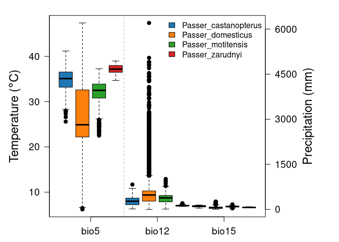<!-- -->

# Plot climate envelope

``` r
# Compare the climatic envelope of two species
climateEnvelope(data=Passer_spp, path=filedir)
```

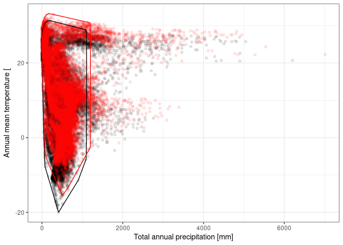<!-- -->

### Compare the range and climatic niche of multiple data sources (IUCN, GBIF, eBird)

``` r
# Merge data into one list
r_data <- rasterize(x=sp_data, y=Passer_domesticus, fun="count")[[1]]
r_data[r_data > 0] <- 1
Passer_data <- list(Passer_domesticus, r_data)
names(Passer_data) <- c("IUCN", "GBIF")
```

# Plot species range

``` r
# Display the range map of both species
plotSp(data=Passer_data, name="Data source", extent=c(-180, 180, -65, 90))
```

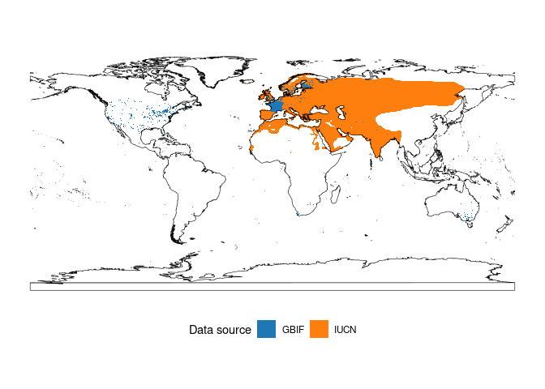<!-- -->

# Plot climatic niche

``` r
# Compare the climatic niche of two datasets
displayNiche(data=Passer_data, variables=c("tmin", "tmax", "prec"), path=filedir, res=10)
```

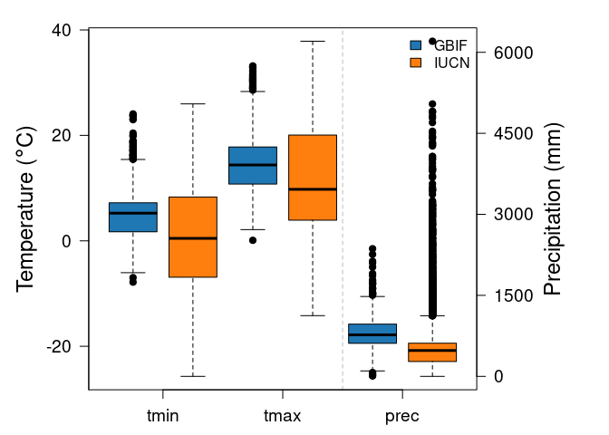<!-- -->
